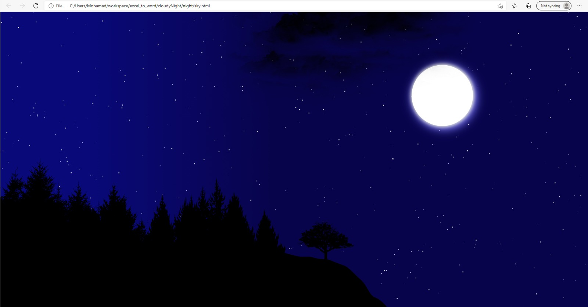

# cloudyNight
In this project, JavaScript codes are used to generate random starts and create the movement of clouds in the sky. To see the output of the project, clone the repository and open sky.html. A snapshot is added here to show the final result. It is worth noting that the movement of stars and clouds are not depicted in the attached image.

